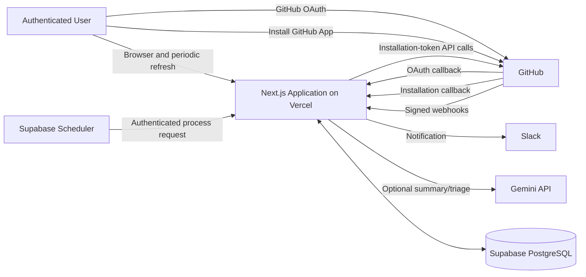
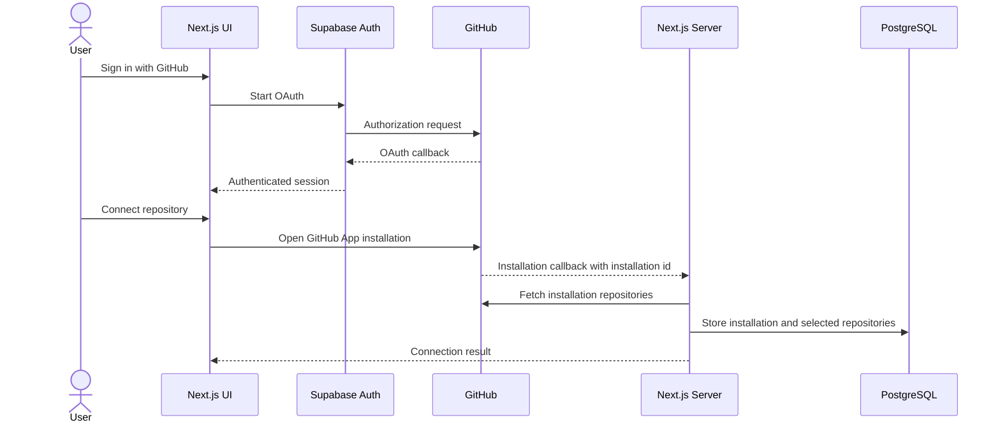
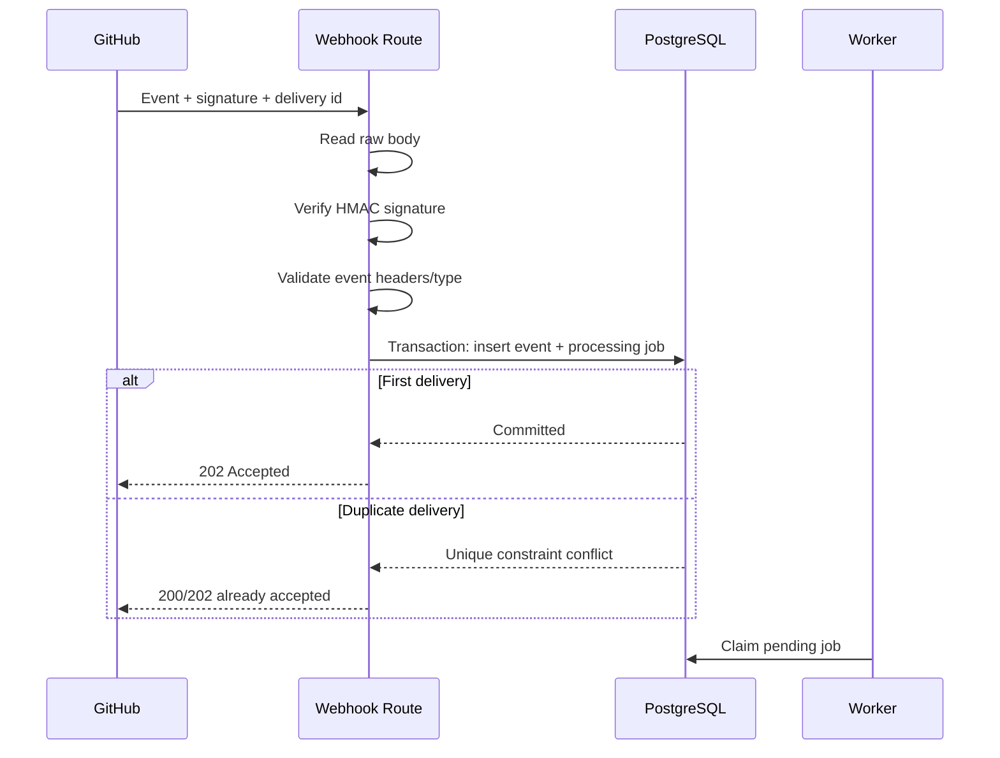
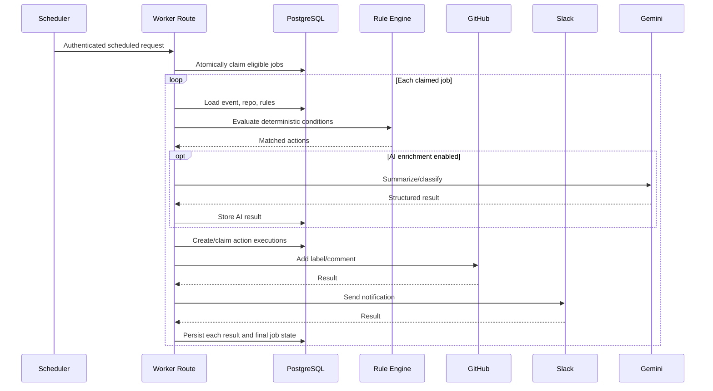

# Architecture

## 1. Architecture style

Use a modular monolith deployed as one Next.js application, backed by Supabase PostgreSQL.

This is intentionally not a microservice architecture. The product is small, the delivery window is 72 hours, and deployment reliability matters more than independent service scaling.

Internal modules still enforce separation of concerns, so individual capabilities could be extracted later if justified.

## 2. Technology map

| Concern | Technology |
|---|---|
| Web UI | Next.js App Router, React, TypeScript |
| Styling | Tailwind CSS, shadcn/ui |
| User authentication | Supabase Auth with GitHub OAuth |
| Repository authorization | GitHub App installation |
| GitHub API | Octokit |
| Webhook transport | GitHub HTTPS webhook |
| Persistence | Supabase PostgreSQL |
| Data access | Drizzle ORM |
| Live dashboard | Authenticated server rendering with safe polling |
| Job scheduling | Supabase PostgreSQL scheduling and HTTP invocation |
| GitHub actions | Installation access tokens |
| Slack | Incoming Webhook |
| AI enrichment | Gemini, optional |
| Deployment | Vercel |
| Validation | Zod |
| Tests | Vitest, React Testing Library, Playwright |

## 3. System context



## 4. Trust boundaries

### Public browser boundary

Browser input is untrusted. Server routes must authenticate the user and authorize every owned resource.

### GitHub webhook boundary

The endpoint is public but trusts only payloads whose `X-Hub-Signature-256` matches an HMAC computed from the raw body using the webhook secret.

### Internal worker boundary

The worker endpoint is publicly addressable because it is deployed serverlessly, but it must require a separate internal secret sent by the scheduler.

### External API boundary

GitHub, Slack, and Gemini calls can time out, rate-limit, reject credentials, or return unexpected data. Every call needs categorized errors and visible execution history.

## 5. Authentication model

### User identity

Supabase Auth authenticates the dashboard user through GitHub OAuth.

This identity controls application ownership and dashboard access.

### Bot identity

A GitHub App authenticates bot operations.

Flow:

1. Server signs a short-lived JWT using the GitHub App private key.
2. Server exchanges it for an installation access token.
3. Server uses that token for the selected installation/repository.
4. The token is short-lived and generated server-side only.

Do not use the user's OAuth token as the primary bot credential.

## 6. Repository connection flow



The callback state must be bound to the authenticated user to prevent installation confusion or cross-user attachment.

## 7. Webhook ingestion flow

The ingestion endpoint must be minimal and durable.



### Why acknowledge before external actions

GitHub write-back, Slack, and AI calls may be slow or unavailable. The webhook should be acknowledged after the event is durably stored, not after every downstream call succeeds.

## 8. Processing flow



## 9. Job claiming

Multiple worker invocations must not process the same job concurrently.

Use an atomic database operation that:

1. selects eligible jobs;
2. locks them with `FOR UPDATE SKIP LOCKED`, or uses an equivalent atomic update;
3. changes their status to `processing`;
4. records `locked_at` and `locked_by`;
5. returns the claimed rows.

A recovery query should return stale `processing` jobs to a retryable state after a safe timeout.

## 10. Rule engine

Rules are deterministic and data-driven.

The authenticated dashboard exposes a deliberately limited configuration form.
Server Actions validate form fields, derive the approved JSON representation,
and call a server-only service that checks tenant ownership. Rule edits and
enable/disable changes increment the version atomically. Rules are retained
rather than deleted so historical evaluations and actions remain auditable.

Initial condition fields:

- event type;
- event action;
- title contains keyword;
- author login equals value;
- label is present or absent.

Initial actions:

- add label;
- send Slack notification;
- optional post comment;
- optional AI enrichment.

Suggested rule representation:

```json
{
  "eventType": "issues",
  "eventAction": "opened",
  "conditions": [
    {
      "field": "title",
      "operator": "contains_case_insensitive",
      "value": "bug"
    }
  ],
  "actions": [
    {
      "type": "github_add_label",
      "config": {
        "label": "bug"
      }
    },
    {
      "type": "slack_notify",
      "config": {
        "template": "default"
      }
    }
  ]
}
```

Do not allow arbitrary JavaScript, regex without safety controls, SQL, URLs, or templates that execute code.

## 11. Idempotency model

### Event ingestion

Unique key: GitHub `X-GitHub-Delivery`.

### Rule evaluation

Unique key: `(event_id, rule_id, rule_version)`.

### External action

Deterministic key derived from:

- event id;
- rule id;
- action type;
- target repository/resource;
- normalized action configuration.

Store the key under a unique constraint.

### GitHub label

Adding a label that already exists on the issue is naturally repeat-safe.

### GitHub comment

Include a marker such as:

```html
<!-- repopilot-action:<deterministic-action-key> -->
```

Before retrying an uncertain comment request, search existing comments for the marker.

### Slack

Create the action-execution record before sending. Do not resend an action marked successful. If the HTTP outcome is ambiguous, record `unknown_outcome`; expose manual review instead of blindly duplicating the notification.

## 12. Retry policy

Suggested defaults:

| Attempt | Delay |
|---:|---:|
| 1 | immediate |
| 2 | 30 seconds |
| 3 | 2 minutes |
| 4 | 10 minutes |
| 5 | 30 minutes |

The actual scheduler may run at minute-level precision, so due jobs are processed on the next scheduler invocation.

Retry:

- network failures;
- timeouts where safe;
- GitHub/Slack 429;
- external 5xx responses;
- temporary token-generation failures.

Do not retry automatically:

- invalid configuration;
- authorization denied;
- repository no longer installed;
- unsupported payload;
- validation failure;
- clear external 4xx errors other than rate limiting.

## 13. Live dashboard

The initial live implementation uses an authenticated 15-second Server
Component refresh. This keeps tenant authorization in server-side Drizzle
queries and avoids exposing broad table access through browser Realtime
subscriptions. Supabase Realtime remains an optional optimization after
user-scoped channel authorization is designed and tested.

Recommended screens:

### Overview

- connected repositories;
- active rules;
- events today;
- successful actions;
- failures requiring attention.

### Event log

- event type/action;
- repository;
- actor;
- received time;
- processing status;
- matched rules;
- action summary.

### Event detail

- sanitized payload summary;
- rule evaluations;
- action attempts;
- retry history;
- errors;
- AI result if enabled.

### Rules

- create/edit/toggle rule;
- select repository;
- choose event/action;
- configure simple conditions;
- choose actions.

### Integrations

- GitHub App installation status;
- repositories;
- Slack test action;
- AI enabled/disabled.

Use server-side authorization for all data. UI hiding is not authorization.

## 14. Suggested repository layout

```text
.
├── AGENTS.md
├── AI_NOTES.md
├── AI_WORK_LOG.md
├── README.md
├── .env.example
├── .agent/
│   └── PLANS.md
├── docs/
│   ├── ASSESSMENT_BRIEF.md
│   ├── PROJECT_CONTEXT.md
│   ├── ARCHITECTURE.md
│   ├── DATA_MODEL.md
│   ├── SECURITY_AND_RELIABILITY.md
│   ├── IMPLEMENTATION_ROADMAP.md
│   ├── DECISIONS.md
│   ├── AI_COLLABORATION_GUIDE.md
│   ├── LEARNING_LOG.md
│   └── plans/
├── drizzle/
├── public/
├── scripts/
├── src/
│   ├── app/
│   │   ├── (auth)/
│   │   ├── (dashboard)/
│   │   └── api/
│   ├── components/
│   ├── db/
│   ├── lib/
│   └── modules/
│       ├── actions/
│       ├── ai/
│       ├── audit/
│       ├── auth/
│       ├── events/
│       ├── github/
│       ├── jobs/
│       ├── rules/
│       ├── slack/
│       └── webhooks/
└── tests/
```

## 15. Deployment topology

- Vercel hosts the Next.js application.
- Supabase hosts Postgres, authentication, and realtime.
- GitHub points the App callback and webhook to the Vercel domain.
- Supabase scheduler invokes the protected worker URL.
- Slack receives notifications through a server-held webhook URL.
- Gemini is invoked only from server-side code.

Preview deployments should not automatically replace production webhook URLs. Maintain one stable production URL for the demo.
