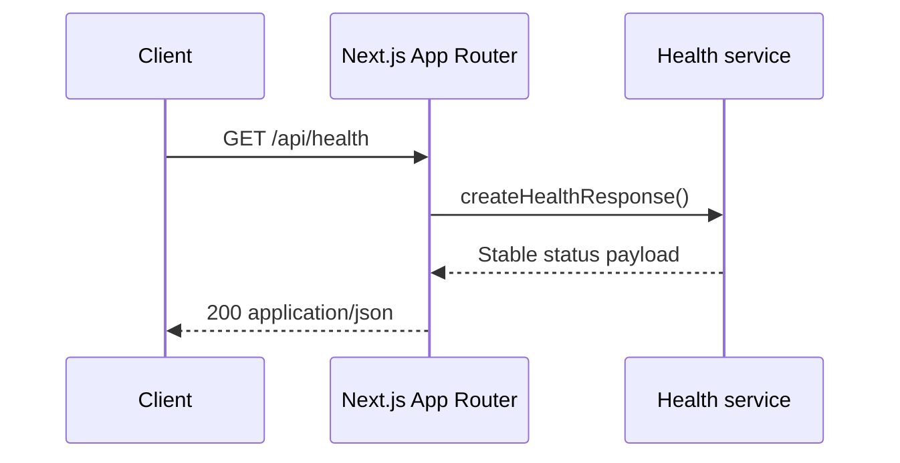

# Project Foundation

## Purpose

Establish a reproducible Next.js engineering baseline for RepoPilot so later authentication, webhook, job-processing, and integration milestones can be implemented and verified safely.

## Current state

The repository contains the assessment context pack but no application scaffold. There is no `package.json`, Next.js configuration, application source tree, test runner, CI workflow, or `.gitignore`. The existing `.env.example` documents future integration variables and must remain secret-free.

## Scope

### Included

- Next.js App Router with React and strict TypeScript.
- Tailwind CSS and ESLint.
- A `src/` layout matching the approved modular-monolith boundaries.
- Zod-based environment validation foundation.
- Vitest configuration and initial health-response coverage.
- A public landing page and `/api/health` route.
- Package scripts for development, type checking, linting, testing, and production builds.
- `.gitignore`, reviewed `.env.example`, CI, and a Phase 0 README.
- Phase 0 entries in `AI_WORK_LOG.md` and `docs/LEARNING_LOG.md`.

### Excluded

- Supabase authentication or persistence.
- GitHub OAuth, GitHub App installation, webhooks, or write-back.
- Job processing, rules, Slack, AI, and live dashboard behavior.
- Vercel/Supabase resource creation or a public deployment.
- Committing, pushing, or opening a pull request.

## Acceptance criteria

- `npm run typecheck`, `npm run lint`, `npm test`, and `npm run build` pass.
- The development server serves the landing page successfully.
- `GET /api/health` returns a stable, non-sensitive success response.
- TypeScript strict mode remains enabled.
- Server environment variables are validated by Zod without entering client bundles.
- `.env.local`, build output, dependencies, and common secret files are ignored.
- CI runs install, type checking, linting, tests, and a production build.
- Existing context documents remain unchanged except for intentional log additions.

## Architecture and flow

The browser requests a route from the Next.js application. App Router renders the landing page as a Server Component by default. The health Route Handler calls a small pure health service and maps its result to JSON. Keeping response construction outside the route provides a testable service boundary and establishes the route-handler pattern required by later milestones.



Future browser UI and API routes remain in one deployable Next.js modular monolith. GitHub credentials, database access, webhook validation, worker authorization, Slack calls, and AI calls will be server-only modules.

## Data model changes

None. Phase 0 introduces no database, schema, table, migration, or persisted application data.

## Security analysis

- Environment schemas are kept in a server-only module and expose no secret values to the browser.
- `.env.example` contains names and safe placeholders only; local environment files are ignored.
- The health route returns only static status and service metadata.
- No authentication boundary or external payload handling is implemented in this phase.
- Dependency versions are locked through `package-lock.json` for repeatable CI installs.

## Reliability analysis

- CI and local scripts provide repeatable validation before integration work.
- The health response is deterministic and has no external dependencies.
- No events or actions exist yet, so durability, idempotency, retries, ambiguous outcomes, and failure history remain later-phase concerns.
- Build or configuration failures are surfaced by local scripts and CI.

## Implementation milestones

### 1. Tooling scaffold

- Files: `package.json`, lockfile, TypeScript/Next/Tailwind/ESLint/Vitest configuration, `.gitignore`.
- Work: configure the supported toolchain and scripts.
- Tests: dependency install and type checking.
- Result: the repository builds as a strict TypeScript Next.js application.

### 2. Application and boundaries

- Files: `src/app/**`, `src/lib/**`, `src/modules/**`, `src/db/**`.
- Work: add the landing page, health route/service, environment validation, and module placeholders.
- Tests: health response unit test.
- Result: `/` and `/api/health` are locally reachable.

### 3. CI and documentation

- Files: `.github/workflows/ci.yml`, `README.md`, `.env.example`, `AI_WORK_LOG.md`, `docs/LEARNING_LOG.md`.
- Work: document and automate the verified development workflow.
- Tests: full local validation and diff review.
- Result: a review-ready Phase 0 branch.

## Verification

Automated:

```bash
npm run typecheck
npm run lint
npm test
npm run build
```

Manual:

1. Run `npm run dev`.
2. Request `/` and confirm the landing page responds.
3. Request `/api/health` and confirm the expected JSON.
4. Confirm no `.env.local` or secret file is tracked.
5. Compare context-document diffs and confirm only intentional logs changed.

## Rollback or recovery

All Phase 0 changes are additive and contain no persisted data. Before commit, files can be reviewed individually and amended without destructive Git operations. After a future commit, revert that commit rather than rewriting shared history.

## Progress

- [x] Read required context and planning documents.
- [x] Assess repository and create the safe feature branch.
- [x] Add tooling scaffold.
- [x] Add application routes and module boundaries.
- [x] Add tests and CI.
- [x] Update documentation and collaboration logs.
- [x] Run automated and manual verification.
- [x] Review the complete diff.

## Decisions and discoveries

- The repository is non-empty and contains tracked assessment context, so a root-level interactive initializer is not safe.
- A reviewed manual scaffold will preserve every existing file.
- The requested Phase 0 is limited to local project foundation; external service creation and public deployment remain human-owned follow-up work.
- The current official Next.js 16.2.12 dependency tree reports high-severity PostCSS and Sharp advisories. npm proposes an incompatible forced downgrade, so no unsafe automatic audit fix was applied; upgrade to a compatible patched release when available.
- PowerShell `Invoke-WebRequest` produced a local null-reference error while checking the landing page. The endpoint was then verified successfully with `curl.exe`; this did not require an application correction.
- Final review found that a broad `>=20.9.0` project engine allowed odd Node releases unsupported by Vitest 4. The engine range and README were narrowed to supported Node 20, 22, and 24+ lines.

## Learning summary

Next.js App Router combines React views and HTTP Route Handlers in one deployment. This is similar to a Spring Boot application containing controllers and services, or a Django project containing views and apps, while React Server Components also render the UI. Internal `src/modules` folders provide package-like boundaries without introducing separately deployed services.
