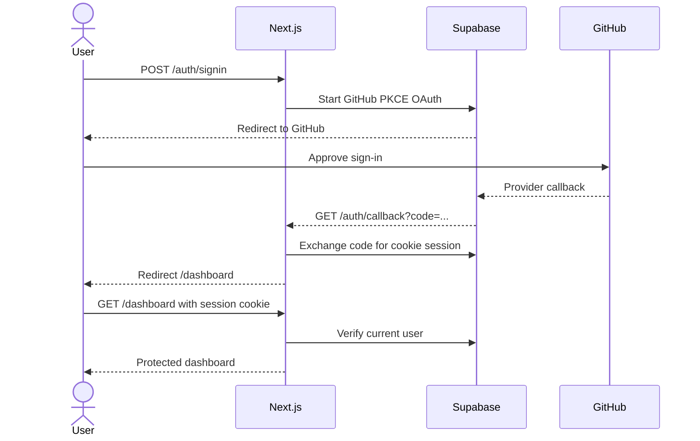

# GitHub Authentication and Protected Dashboard

## Purpose

Allow users to sign in with GitHub through Supabase Auth, maintain a cookie-based server session, access a protected dashboard, and sign out.

## Current state

The application has a public landing page and health route but no authentication dependencies, session handling, protected routes, or Supabase clients. Supabase, GitHub OAuth, redirect URLs, and public Vercel environment values have been configured externally by the developer.

## Scope

### Included

- Supabase SSR browser and server clients.
- GitHub OAuth sign-in.
- PKCE callback code exchange.
- Cookie refresh proxy.
- Protected dashboard shell.
- Sign-out.
- Safe internal redirect validation.
- Auth configuration and redirect tests.
- README, learning log, and AI work log updates.

### Excluded

- Application profile tables or profile synchronization.
- Drizzle schema and database migrations.
- GitHub App installation or repository access.
- Webhooks, jobs, rules, Slack, AI, and realtime data.
- Service-role access.

## Acceptance criteria

- A signed-out visitor cannot access `/dashboard`.
- A user can start GitHub OAuth from the landing page.
- A successful callback establishes a cookie session and opens `/dashboard`.
- A malformed callback fails safely without exposing provider details.
- Sign-out clears the current session and returns home.
- Redirect parameters cannot send users to another origin.
- Typecheck, lint, tests, and production build pass.

## Architecture and flow



## Data model changes

None. Supabase Auth owns its internal `auth.users` records. An application profile table is deferred until its ownership and migration requirements are designed.

## Security analysis

- OAuth uses Supabase SSR's PKCE and cookie storage.
- Callback and dashboard verification happen server-side.
- Only relative internal `next` paths are accepted.
- Publishable values may reach the browser; secret/service-role values may not.
- Authentication errors are sanitized before being shown to users.
- Protected pages are dynamic and are not shared through static caches.

## Reliability analysis

- The session proxy refreshes expiring cookies on both request and response.
- Auth provider errors redirect to a stable user-facing state.
- GitHub or Supabase outages do not affect the public health endpoint.
- No application database writes occur in this milestone.

## Implementation milestones

1. Configuration and Supabase clients.
2. Sign-in, callback, sign-out, and session refresh.
3. Protected dashboard and landing-page states.
4. Tests, documentation, and verification.

## Verification

```bash
npm run typecheck
npm run lint
npm test
npm run build
npm run dev
```

Manual flows:

1. Signed-out `/dashboard` redirects home.
2. GitHub sign-in returns to `/dashboard`.
3. Dashboard displays the authenticated GitHub identity.
4. Sign-out removes access.
5. Production OAuth succeeds after the PR deploys.

## Rollback or recovery

The change adds no application tables. Reverting the feature commit removes application auth behavior; external GitHub/Supabase configuration can remain disabled or be removed independently.

## Progress

- [x] Assess current repository and external prerequisites.
- [x] Add dependencies and configuration.
- [x] Implement auth/session flow.
- [x] Add protected dashboard.
- [x] Add tests and documentation.
- [x] Run full automated verification.
- [x] Complete human local OAuth consent verification.
- [ ] Complete production verification after deployment.
- [x] Review the complete diff.

## Decisions and discoveries

- Use `@supabase/ssr`, not deprecated auth-helper packages.
- Use server-verified user data for protected access.
- Defer profile persistence because it requires a deliberate application schema and ownership policy.
- Limit the session proxy to auth and dashboard routes so a Supabase outage cannot block the public landing or health endpoints.
- An initial all-routes proxy matcher was narrowed during review after identifying the unnecessary availability coupling.
- Local review found `NEXT_PUBLIC_APP_URL` absent from `.env.local`; the non-secret localhost value was added. Production still requires the canonical Vercel value.
- The first manual OAuth attempt fell back to the production Site URL because the localhost callback was not accepted by the Supabase redirect allowlist. Adding trusted-origin callback patterns corrected the flow.
- The developer verified GitHub consent, authenticated dashboard access, sign-out, blocked direct dashboard access, and successful reauthentication.

## Learning summary

Supabase Auth acts as the identity provider broker. Next.js Route Handlers perform OAuth transitions, the proxy refreshes cookie sessions, and Server Components verify authorization before rendering protected information.
