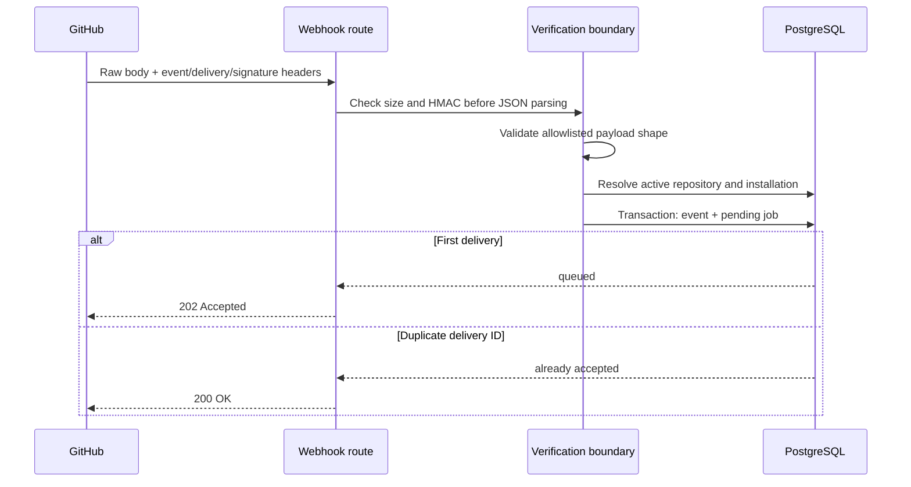

# GitHub Webhook Ingestion

## Goal

Accept authentic GitHub issue and pull-request webhooks, persist every delivery
exactly once with a pending processing job, and acknowledge GitHub before any
slow downstream automation begins.

## Included

- Raw-body HMAC-SHA256 verification with constant-time comparison.
- Required GitHub event, delivery, and signature headers.
- Signed `ping` acknowledgement for GitHub App setup.
- Allowlisted `issues` and `pull_request` payload validation.
- Repository and installation mapping to the existing authenticated owner.
- Immutable webhook-event storage and one pending processing job.
- Transactional insertion and duplicate-delivery handling.
- Payload size limit and safe structured ingestion logs.
- Database migration, RLS policies, tests, and documentation.

## Excluded

- Job claiming or scheduled worker endpoint.
- Rule evaluation.
- GitHub write-back, Slack notification, or Gemini enrichment.
- Dashboard event history.

## Request flow



## Security decisions

- Read the request body once and verify its exact bytes before parsing JSON.
- Never log the raw payload, signature, webhook secret, or request headers.
- Store only deliveries for active repository/installation mappings.
- Require the repository and installation IDs in the signed payload to match
  one existing database ownership path.
- Use RLS for event ownership and job ownership through the parent event.

## Reliability decisions

- Use GitHub's delivery ID as the unique idempotency key.
- Insert the event and processing job inside one transaction.
- Treat a unique duplicate as successfully accepted without creating a job.
- Do not make GitHub, Slack, or AI calls in the ingestion request.
- Keep the processing job pending for the Phase 4 worker.

## Verification

```powershell
npm run db:generate
npm run db:migrate
npm run typecheck
npm run lint
npm test
npm run build
```

Manual production verification:

1. Configure the same strong webhook secret in Vercel and the GitHub App.
2. Set the webhook URL to `/api/github/webhooks`.
3. Enable webhooks and subscribe only to Issues and Pull requests.
4. Confirm GitHub's signed ping succeeds.
5. Open a test issue and pull request.
6. Confirm one event and one pending job per delivery in Supabase.
7. Redeliver one delivery and confirm no duplicate rows are created.

## Progress

- [x] Review the merged Phase 2 architecture and database.
- [x] Create `feature/webhook-ingestion`.
- [x] Add schema and migration.
- [x] Implement verification and ingestion.
- [x] Add route and tests.
- [x] Apply migration.
- [x] Run final full verification.
- [x] Document and manually verify production.

Production evidence: an `issues.opened` delivery returned HTTP 202 and created
one event plus one pending job. Redelivery returned HTTP 200, and the database
still contained exactly one event and one job.
