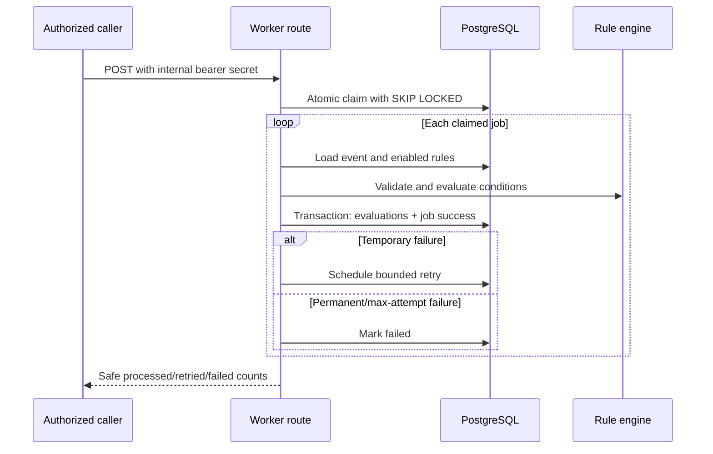

# Durable Job Worker and Rule Engine

## Goal

Safely claim pending webhook jobs, evaluate deterministic versioned rules, store
the decision history, and finish or retry each job without concurrent processing.

## Included

- Automation-rule and rule-evaluation tables with tenant ownership and RLS.
- One seeded demonstration rule for existing connected repositories.
- Authenticated internal worker route.
- Atomic `FOR UPDATE SKIP LOCKED` job claiming.
- Recovery of stale processing locks.
- Deterministic issue and pull-request condition evaluation.
- Versioned, duplicate-safe rule-evaluation records.
- Bounded retry scheduling and permanent-failure handling.
- Safe worker logs, tests, migration, and documentation.

## Excluded

- GitHub labels/comments and installation-token generation.
- Slack and Gemini calls.
- Scheduler configuration.
- Rule-management UI.

## Processing flow



## Rule model

Initial conditions:

- title contains a case-insensitive value;
- author login equals a case-insensitive value;
- label is present;
- label is absent.

Actions are validated and retained for later phases, but Phase 4 does not execute
them. Initial action types are `github_add_label` and `slack_notify`.

## Security and reliability

- The route accepts only a constant-time-verified internal bearer secret.
- Claiming is one atomic SQL statement, so concurrent workers cannot claim the
  same row.
- Stale locks become eligible again after five minutes.
- Evaluation uniqueness is `(event_id, rule_id, rule_version)`.
- Errors stored in jobs are categorized and sanitized.
- Retry attempts are capped and use 30-second, 2-minute, 10-minute, and
  30-minute delays.

## Verification

```powershell
npm run db:generate
npm run db:migrate
npm run typecheck
npm run lint
npm test
npm run build
```

Production:

1. Configure the same `INTERNAL_WORKER_SECRET` locally and in Vercel.
2. Invoke the worker without/with a wrong secret and expect HTTP 401.
3. Invoke it with the correct bearer secret.
4. Confirm the Phase 3 pending job becomes `succeeded`.
5. Confirm its versioned rule evaluation exists.
6. Invoke two workers together and confirm no job is processed twice.

## Progress

- [x] Review Phase 3 production evidence and existing queue.
- [x] Create `feature/job-worker-rule-engine`.
- [x] Add schema and migration.
- [x] Implement worker and rule engine.
- [x] Add tests.
- [x] Apply migration and run verification.
- [x] Verify production and document evidence.

Production evidence: an unauthorized request returned HTTP 401. Two simultaneous
authorized workers produced one claimed/succeeded job and one zero-claim result.
The database recorded one non-matching versioned evaluation and processed the
event once.
