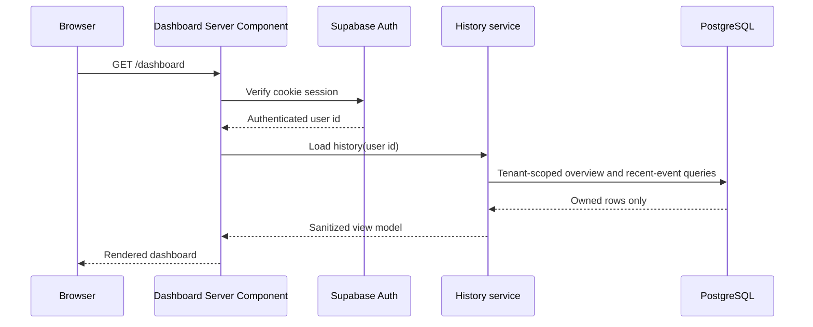

# Authenticated Automation History Dashboard

## Purpose

Show an authenticated user the recent GitHub events, rule matches, processing
state, action outcomes, attempts, and safe failure details for repositories they
connected to RepoPilot.

## Current state

`src/app/dashboard/page.tsx` authenticates with Supabase and lists repositories.
Webhook events, processing jobs, rule evaluations, and action executions are
already persisted by the ingestion and worker phases.

## Scope

### Included

- Tenant-scoped server queries for dashboard metrics and 25 recent events.
- Overview cards for repositories, active rules, today's events, successes, and
  actions needing attention.
- A recent event timeline with job, rule, and action history.
- Empty states and safe failure summaries.
- Automated tests for tenant isolation and presentation behavior.

### Excluded

- Raw webhook payload display.
- Browser-side database access or Supabase Realtime subscriptions.
- Event detail pages, filters, pagination, and rule editing.
- Scheduler and AI enrichment.

## Acceptance criteria

- Signed-out users cannot access the dashboard.
- A signed-in user sees only rows owned by their Supabase user id.
- Recent events show repository, event/action, actor, resource number, time,
  processing status, match result, and action attempts/status.
- Retry, permanent failure, and unknown outcome states are visibly distinct.
- No secret, raw payload, idempotency key, or internal lock value is rendered.

## Architecture and flow

The authenticated Server Component passes the verified Supabase user id to a
server-only history service. The service filters events by both event and
repository ownership, loads related rows for only those event ids, and maps them
to a safe view model. React renders that model; the browser receives no database
credentials. A small client component refreshes the authenticated Server
Component every 15 seconds.



## Data model changes

None. Existing ownership columns and indexes support the query.

## Security analysis

- Identity comes only from the verified Supabase session.
- Queries constrain `user_id`; events additionally join an owned repository.
- The assembler rejects mixed-tenant rows as defense in depth.
- Raw payloads and internal identifiers are not returned to React.
- React escapes repository, actor, status, and error strings.

## Reliability analysis

The page is read-only and cannot change processing state. It displays persisted
statuses, attempts, and sanitized errors, so retry and ambiguous outcomes remain
visible. A database failure fails the authenticated page rather than presenting
invented success.

## Implementation milestones

1. Add the server-only query and pure safe-view-model assembler.
2. Test tenant isolation, grouping, limits, and status presentation.
3. Replace placeholder event copy with overview and history UI.
4. Update project and AI learning documentation.
5. Run all repository quality checks.

## Verification

```bash
npm run typecheck
npm run lint
npm test
npm run build
```

Manually sign in, open `/dashboard`, compare the newest issue to the database
history, and confirm a signed-out request redirects home.

## Rollback or recovery

Revert this phase. It adds no migration and performs no writes, so rollback
cannot corrupt persisted events or actions.

## Progress

- [x] Create feature branch and plan.
- [x] Implement secure history service and tests.
- [x] Build dashboard history UI.
- [x] Update documentation.
- [x] Run complete verification.

## Decisions and discoveries

- Start with server-rendered history and a 15-second `router.refresh()` polling
  fallback. Realtime is deferred until tenant-scoped subscriptions are proven.
- Limit the first view to 25 events and omit raw payloads.
- Preview OAuth initially failed because authentication redirects always used
  the canonical production URL. Preview deployments now use Vercel's trusted
  `.vercel.app` deployment URL, keeping the PKCE cookie and callback on the same
  origin; production continues using the configured canonical URL.

## Learning summary

The Server Component acts like an authenticated controller: it obtains the
trusted user id and calls a server-only service. Drizzle adds ownership
conditions to SQL, while a pure mapper groups related jobs, evaluations, and
actions into a safe view model. The small Client Component does not query the
database; it only asks Next.js to rerun the protected server page.
